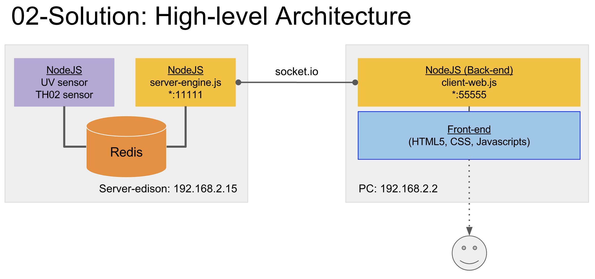

02 - Solution
=============
Here we let NodeJS client program (client-web.js) to handle all computational and visualization (PubNub: Eon Charts). 



Setup Sensor Node (SN)
----------------------
1. Go to 'sensor-node' directory.

2. Resolve dependencies.
```
$ npm install
```

3. Run SN (serv-random.js). This will generate random values and send it through Socket.IO stream.
```
$ node serv-random.js
``` 

Setup Client-Web
----------------
1. Go to 'client-web' directory.

2. Resolve dependencies
```
$ npm install 
```

2. Run the web (client-web.js). 
```
$ node client-web.js
```